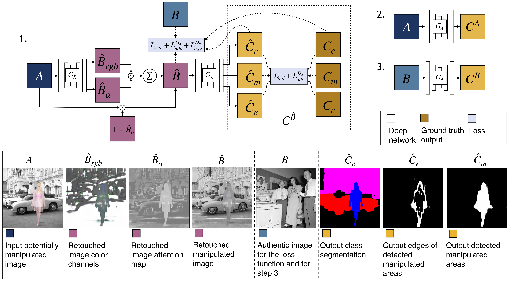

# MAGritte in PyTorch

Image manipulation detection and localization using Mixed Adversarial Generators. Code for the paper The Point Where Reality Meets Fantasy: Mixed Adversarial Generators for Image Splice Detection, NIPS 2019.

The code was written by [Vladimir V. Kniaz](https://github.com/vlkniaz) and [SolidHuman](https://github.com/SolidHuman).

**Note**: The current software works well with PyTorch 1.2+ and Python 3.7+.

**Pix2pix:  [Project](http://zefirus.org/en/MAG) |  [Paper](https://nips.cc/Conferences/2019/Schedule)**



## Prerequisites
- Linux or macOS
- Python 3
- CPU or NVIDIA GPU + CUDA CuDNN

## Getting Started
### Installation

- Clone this repo:
```bash
git clone https://github.com/vlkniaz/MAGritte
cd MAGritte
```

- Install [PyTorch](http://pytorch.org) 0.4+ and other dependencies (e.g., torchvision, [visdom](https://github.com/facebookresearch/visdom) and [dominate](https://github.com/Knio/dominate)).
  - For pip users, please type the command `pip install -r requirements.txt`.
  - For Conda users, we provide a installation script `./scripts/conda_deps.sh`. Alternatively, you can create a new Conda environment using `conda env create -f environment.yml`.
  - For Docker users, we provide the pre-built Docker image and Dockerfile. Please refer to our [Docker](docs/docker.md) page.

### MAGritte train/test
- Download a fantastic_reality dataset:
```bash
bash ./datasets/download_fantastic_reality_dataset.sh
```
- Train a model:
```bash
bash ./scripts/train_magritte_edge.sh
```
- To view training results and loss plots, run `python -m visdom.server` and click the URL http://localhost:8097. To see more intermediate results, check out  `./checkpoints/magritte_magritte_edge/web/index.html`.

- Test the model:
```bash
bash ./scripts/test_magritte_edge.sh
```
- The test results will be saved to a html file here: `./results/magritte_magritte_edge/test_latest/index.html`.

## [Datasets](docs/datasets.md)
Download MAGritte dataset and create your own datasets.

## Citation
If you use this code for your research, please cite our papers.
```
@inproceedings{MAG2019
...
}
```


## Related Projects
**
[ManTraNet](https://github.com/ISICV/ManTraNet) | [Fighting Fake News](https://github.com/minyoungg/selfconsistency)**

## Acknowledgments
Our code is based on [pix2pix](https://github.com/phillipi/pix2pix).
